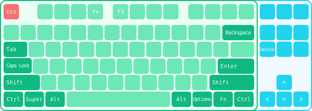
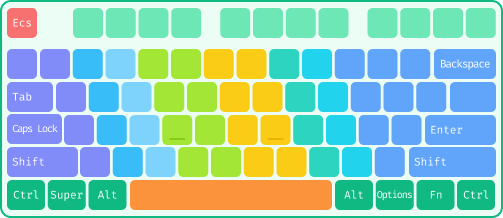

prepared by: #SMostafaSarvi
## Types of keyboards

- Compact | 
- Ten key less |  +  
- Full Size |  +   +  
## Common Keys

1. `Esc` (Escape)
	- Commonly used to exit From Some states in apps.
		Such as exiting full screen mode.
1. `Ctrl` (Control)
	 - Use in most of shortcuts.
		Such as `Ctrl + C` that copies a text etc.
3. `alt` (Alternate)
	- Like `Ctrl` used mostly in shortcuts.
		Such as `Alt + F4` that close programs.
4. `Shift`
	-  To type other state of key that pressed after holding `Shift`.
		Such as `Shift + [` that types `{`. 
5. `Delete`
	- Remove a character once pressed from first to last.
1. `Backspace`
	- Remove a character once pressed from last to first.
2. `Enter` | `Return`
	- Use to go next line.
	- Use to execute a command in command line.
3. `Super` | `Windows` | `Command` | ...
	- Use for launch especial OS App.
		Such as Launching Settings Using `Super + L`.
## Common Shortcuts
 These shortcuts are mostly for Windows.
#### `Ctrl`
- `Ctrl + C`: Copy 
- `Ctrl + X`: Cut 
- `Ctrl + V`: Paste
- `Ctrl + Z`: Undo
- `Ctrl + F`: Find
- `Ctrl + P`: Print
- `Ctrl + +`: Zoom in
- `Ctrl + -`: Zoom Out 
- `Ctrl + W`: Exit Current Tab
- `Ctrl + S`: Save
- `Ctrl + Tab`: Change Tabs
- `Ctrl + R`: Reload tab
#### `Alt`
- `Alt + Tab`: Change Windows
- `Alt + F4`: Exit From window
#### `Win` | `Super`
- `Win`: To load Start menu
- `Win + Tab`: Desktops Overview
- `Win + L`: Lock Windows
- `Win + I`: Setting
- `Win + P`: Projection Menu
- `Win + S`: Search Box
- `Win + E`: File Explorer
- `Win + R`: Run Prompt
- `Win + D`: Raise Desktop
- `Win + V`: Clipboard history
- `Win + N`: Notifications
- `Win + M`: Minimize All Apps
####  Functions
- `F2`: Rename
- `F5`: Refresh
- `Fn + Fx`: Do things are drawn on your `F1` to `F12` keys.
	
	 Your keyboard may have `fn` Lock. It means by default `fn` key always is on
		to toggle this you have to hold `fn + fn lock` key on your keyboard.
	
	 If your `fn` be locked you could not use e.g. `Alt + F4`.
## 10 finger fast type

On your keyboard two keys have bumps, put you pointing fingers on them and arrange others like above shape.
Try to type some thing and consider the areas on above shape.
Exercise it many time to get advanced in it.
Sites that help in 10 finger typing:
- [monkeytype.com](https://monkeytype.com/)`Best`
- [keybr.com](https://www.keybr.com/)`look good`
- [nitrotype.com](https://www.nitrotype.com)`fantasy`
Good job! =)